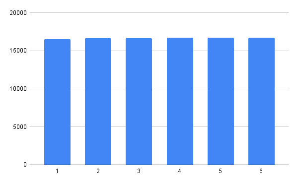
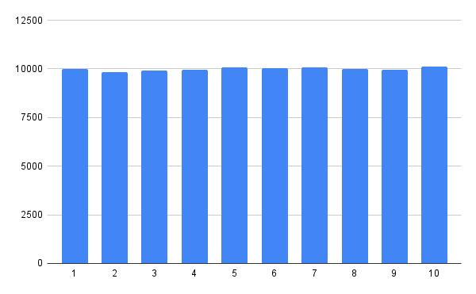
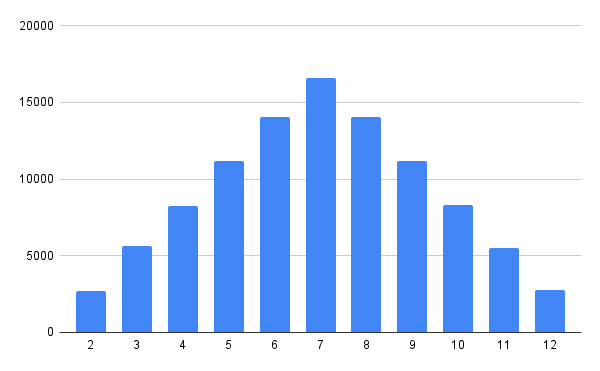
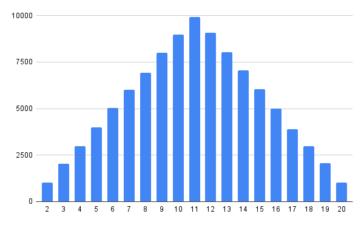
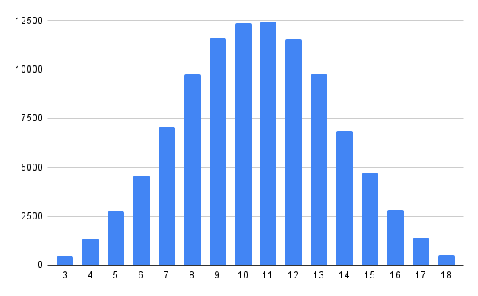
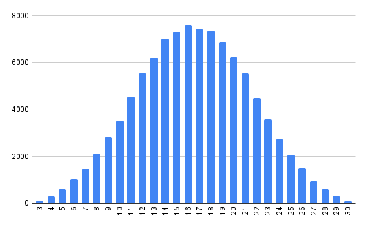

1) Для случая, где один бросок кубика можно сказать что распределение дискретное равномерное.  \ значения стремятся выпадать одинакове число раз при увеличении числа бросков
2) Для случаев, где два или более бросоков кубиков распределение принимает вид биномиального. Графики для двух кубиков   \Графики для трёх кубиков  \ Здесь при увеличении числа кубиков и бросков значения симметрично рассходятся от центрального значения 
$$
центр = (\frac{мин + макс}{2})
$$
для двух кубиков д6 соответсвенно это (12+2)/2 = 7\
для двух кубиков д10 соответсвенно это (20+2)/2 = 11

для трёх кубиков д6 соответсвенно это (3+18)/2 = 10.5\
для трёх кубиков д10 соответсвенно это (3+30)/2 = 16.5
